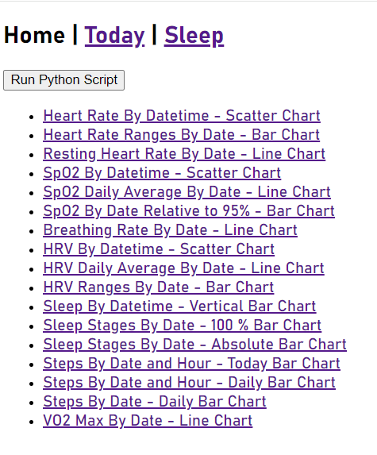
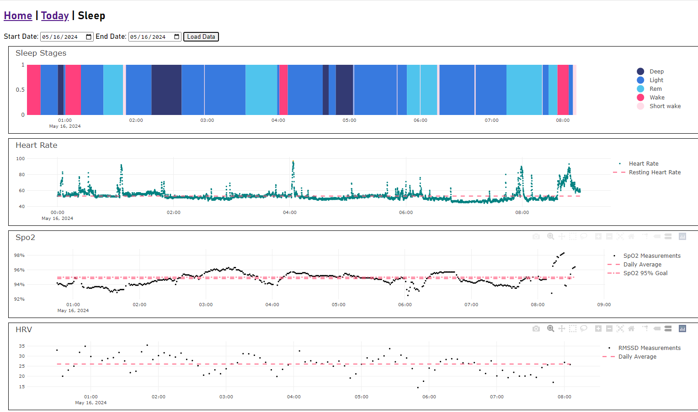
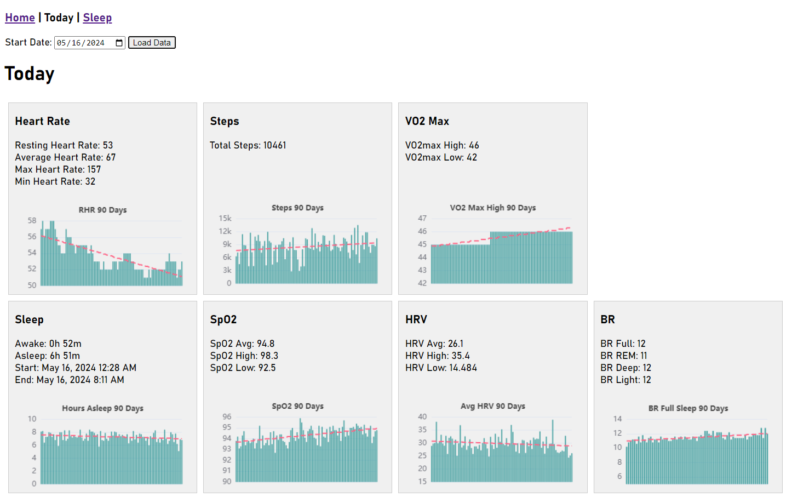
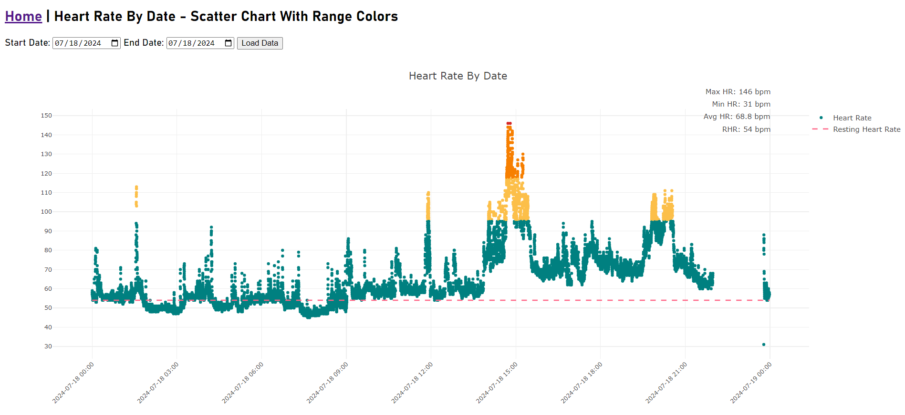
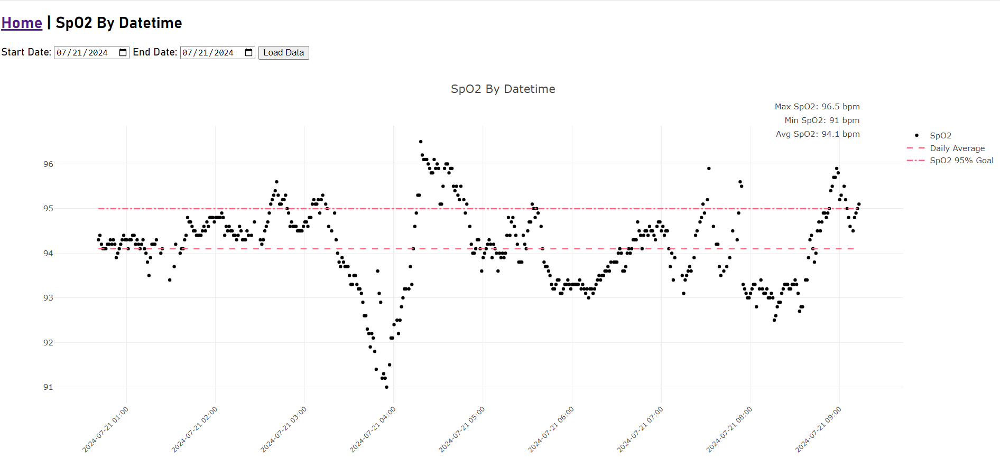
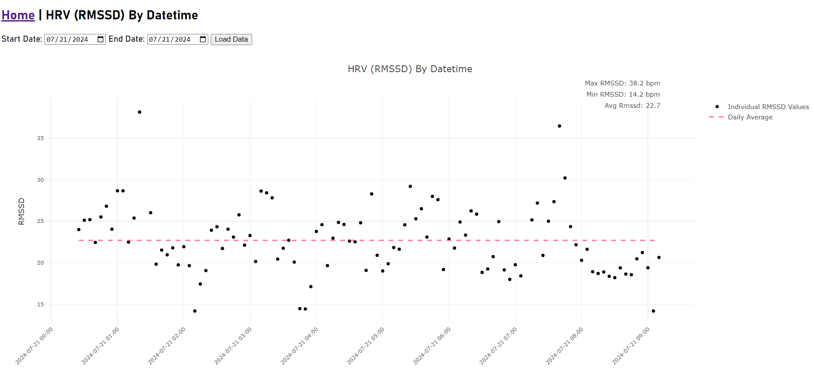

# Fitbit Web API Data ETL and Visualization

This repo uses the <a href="https://dev.fitbit.com/build/reference/web-api/">Fitbit Web API</a> with Python to retrieve and save API responses as JSON files. The JSON files are then loaded into a MongoDB database. Node and Express.js are used to serve the MongoDB data to the HTML pages containing Plotly.js visualizations.

Not all Fitbit web API endpoints are retrieved and not all of the JSON response data is being loaded and visualized. See list below for details on what is available here.

Data transformation occurs in several places: 

1) ETL - Python code retrieval transformation before it is loaded to MongoDB. Augmentation and restructuring of Fitbit Web API data to fit common use cases.
2) Frontend - Node API Javascript transformation of MongoDB data to create specific endpoints to fit specific sometimes shared use cases.
3) Frontend - HTML page Javascript transformations of Node API data to tailor Node API data for specific use cases.

# Goals and Objectives

This project was created to augment and extend the data and visualizations that are available in the Fitbit app and dashboard. Fitbit devices actually record a lot of detailed data that you may never see on the Fitbit app. 

Fitbit visualizations almost always contain only summarized data. For example, while the Fitbit app shows only a single average SpO2 value for a night's sleep, sleep SpO2, HRV and heart rate are recorded every few seconds.  

This second level detailed data can be very informative. For example, individual second level heart rate measurements throughout the day, or SpO2 measurements made throughout sleep sessions can be presented as scatter charts, histograms, distribution plots (eg box or violin), or binned into ranges.

The interactive web pages include:

1) Today page - web page that provides a snapshot of today's data.
2) Sleep page - web page that shows detailed sleep activity.
3) Home page - web page listing links to many other visualization pages (see screenshot and notes below for what is available).

# Screenshots

## Home page screenshot

## Sleep page screenshot

## Today page screenshot

## Home | Heart Rate By Date - Scatter Chart screenshot

## Home | SpO2 By Datetime - Scatter Chart screenshot 

## Home | HRV By Datetime - Scatter Chart screenshot

## Technical features:

* PyCherry used to pop Fitbit authentication login browser window.
* Fitbit authentication token is saved locally as json file (*auth_tokens.json*). 
* Uses refresh token to get new tokens automatically.
* Response log (*response_log.json*) records the last API call response date for each API endpoints.
* Activity log (*activity_log.json*) records retrieval activity including response errors and messages.

## Usage:

* Assumes you already have a Fitbit dev account to create a new API app and get the app's CLIENT_ID and CLIENT_SECRET. 

* Install Node in the project folder.

* Node server needs to be started manually: *Node server.js*

* Configure MongoDB database connection in the *db_connection.py* file.

* Create a credentials file outside of the project to contain CLIENT_ID and CLIENT_SECRET and then create an environment variable named "key_file" so it can be called in the code. Format as below:

config_fitbit = {
    'CLIENT_ID': 'xxx',
    'CLIENT_SECRET': 'xxx'
    }

* Run *auth_get_tokens.py* to authenticate in pop-up browser on Fitbit login. This will save a file *auth_tokens.json* that contains tokens for subsequent authentication. You only have to run this once to get the token file. The *access_token* has an 8 hour lifetime while the *refresh_token* is valid until its first use. Subsequently, the *get_response.py* file includes a process to use the *refresh_token* to get a new *access_token* and new *refresh_token* automatically.

* Modify the *response_log.json* file date field values for all endpoints to a date two days ago. Date format is YYYY-MM-DD. 

* Start the Node server by running *server.js*.

* Get data from the Fitbit API. Do this daily or whenever you want to get data. You can use either method below. When you run *get_all_data.py* it will use the *response_log.json* dates for date range to retrieve. It is recommended to start off by downloading a small of amount of data, say the last two days' data due to API rate limiting. The API has rate limits that make getting historical data take a while as the code pauses for rate limit time-outs. You could let *get_all_data.py* run and it will iteratively pause during timeouts and continue downloading until the next timeout.

To run *get_all_data.py*:

    1) Click *Run Python Script* button on the Home, Sleep and Today pages (requires Node server.js file is running). This will use Javascript and Node to run the *get_all_data.py* module and show a message on the page when it is finished.

    OR

    2) Manually run the *get_all_data.py* module on the command line: *python -m etl.get_all_data* 

* Browse to *http://localhost:3000/* and view the reports.

## Endpoint data retrieved from API:

* Get Activity Intraday by Date - calories
* Get Activity Intraday by Date - distance
* Get Activity Intraday by Date - elevation
* Get Activity Intraday by Date - floors
* Get Activity Intraday by Date - steps
* Get Breathing Rate Intraday by Interval
* Get ECG Log List
* Get Heart Rate Intraday by Date
* Get HRV Intraday by Interval 
* Get Sleep Log by Date Range
* Get SpO2 Intraday by Interval
* Get Temperature (Skin) Summary by Date
* Get VO2 Max Summary by Interval

## JSON responses inserted into MongoDB and visualized:

* Get Heart Rate Intraday by Date (viz) 
* Get Breathing Rate Intraday by Interval (viz)
* Get HRV Intraday by Interval (viz)
* Get Sleep Log by Date Range (viz)
* Get SpO2 Intraday by Interval (viz)
* Get VO2 Max Summary by Interval (viz)
* Get VO2 Max Summary by Interval (viz)
* Get Temperature (Skin) Summary by Date (no viz yet)
* Get Activity Intraday by Date - steps (no viz yet)

## Home page visualization links available:

* Heart Rate By Datetime - Scatter Chart
* Heart Rate Ranges By Date - Bar Chart
* Heart Rate By Date - Zone vs Resting Chart
* Resting Heart Rate By Date - Line Chart
* SpO2 By Datetime - Scatter Chart
* SpO2 Daily Average By Date - Line Chart
* SpO2 By Date Relative to 95% - Bar Chart
* Breathing Rate By Date - Line Chart
* HRV By Datetime - Scatter Chart
* HRV Daily Average By Date - Line Chart
* HRV Ranges By Date - Bar Chart
* Sleep By Datetime - Vertical Bar Chart
* Sleep Stages By Date - 100 % Bar Chart
* Sleep Stages By Date - Absolute Bar Chart
* Steps By Date and Hour - Today Bar Chart
* Steps By Date and Hour - Daily Bar Chart
* Steps By Date - Daily Bar Chart
* VO2 Max By Date - Line Chart