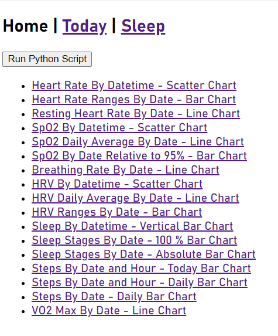
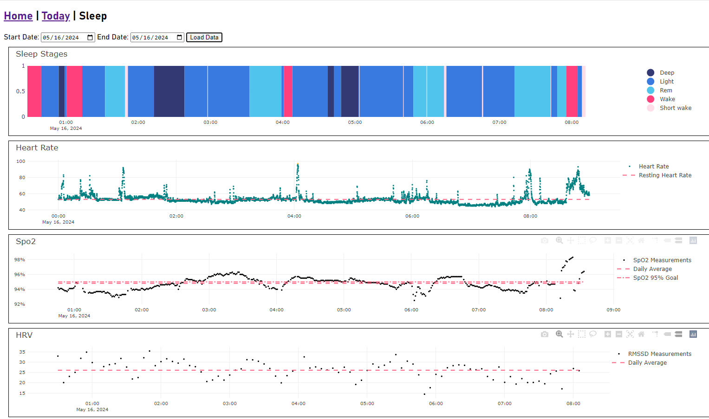
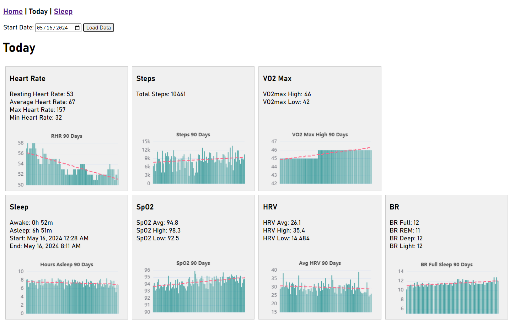

# Fitbit Web API Data ETL and Visualization

This repo uses the <a href="https://dev.fitbit.com/build/reference/web-api/">Fitbit Web API</a> with Python to retrieve and save API responses as JSON files. The JSON files are then loaded into a MongoDB database. Node and Express.js are used to serve the MongoDB data to the HTML pages containing Plotly.js visualizations.

Not all Fitbit web API endpoints are retrieved and not all of the JSON response data is being loaded and visualized. Transformation of the data occurs either before it is loaded to MongoDB, in the Node API server or the HTML page Javascript.

Currently the visualizations interactive features only includes an option to manually select range of days before current date. Eg 1 for today, 2 for today and yesterday, etc.

# Use Case

These visualizations augment what Fitbit provides in their app. Fitbit visualizations almost always contain only summarized data. For example, the app shows only a single average SpO2 value for a night's sleep. However, Fitbit devices actually record a lot of detailed data that you may never see on the Fitbit app. For example, SpO2, HRV and heart rate are recorded every at few seconds. The visualizations here use the detailed API data. It can be very informative to see actual heart rate measurements throughout the day, or to see all of the individual SpO2 measurements made throughout sleep sessions.

## Home page

## Sleep page screenshot

## Today page screenshot

## Technical features:

* PyCherry used to pop Fitbit authentication login browser window.
* Fitbit authentication token is saved locally as json file (*auth_tokens.json*). 
* Uses refresh token to get new tokens automatically.
* Response log (*response_log.json*) records the last response dates for each API endpoints. 
* Activity log (*activity_log.json*) records retrieval activity including response errors and messages.

## Usage:

* Assumes you already have a Fitbit dev account to create a new API app and get the app's CLIENT_ID and CLIENT_SECRET. 

* Install Node in the project folder.

* Node server needs to be started manually: *Node server.js*

* Configure MongoDB database connection in the *insert* modules.

* Create credentials file to contain CLIENT_ID and CLIENT_SECRET and then create an environment variable named "key_file" so it can be called in the code. Format as below:

config_fitbit = {
    'CLIENT_ID': 'xxx',
    'CLIENT_SECRET': 'xxx'
    }

* Run *auth_get_tokens.py* to authenticate in pop-up browser on Fitbit login. This will save a file *auth_tokens.json* that contains tokens for subsequent authentication. You only have to run this once to get the token file. Subsequently, the ETL code includes a built-in process to use the refresh token to get new tokens if they are expired.

* Run the ETL Python process to get Fitbit data by running: *python -m etl.get_all_data*. Do this daily or whenever you want to get data.

It is recommended to start off by downloading a small of amount of data, say the last two days' data due to API rate limiting. To do this, modify *response_log.json* date field values for all endpoints to a date two days ago. When you run get_all_data it will use these dates for date range. Afterwards you can get additional day's data but note that the API rate limits makes historical data retrieval take a while as the code pauses for rate limit time-outs.

* Browse to *http://localhost:3000/* and view reports.

## Endpoint data retrieved from API:

* Get Activity Intraday by Date - calories
* Get Activity Intraday by Date - distance
* Get Activity Intraday by Date - elevation
* Get Activity Intraday by Date - floors
* Get Activity Intraday by Date - steps
* Get Breathing Rate Intraday by Interval
* Get ECG Log List
* Get Heart Rate Intraday by Date
* Get HRV Intraday by Interval 
* Get Sleep Log by Date Range
* Get SpO2 Intraday by Interval
* Get Temperature (Skin) Summary by Date
* Get VO2 Max Summary by Interval

## JSON responses inserted into MongoDB and visualized:

* Get Heart Rate Intraday by Date (viz) 
* Get Breathing Rate Intraday by Interval (viz)
* Get HRV Intraday by Interval (viz)
* Get Sleep Log by Date Range (viz)
* Get SpO2 Intraday by Interval (viz)
* Get VO2 Max Summary by Interval (viz)
* Get VO2 Max Summary by Interval (viz)
* Get Temperature (Skin) Summary by Date (no viz yet)
* Get Activity Intraday by Date - steps (no viz yet)

