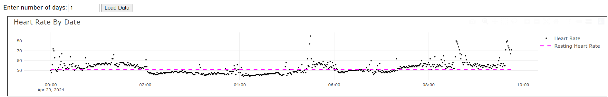

# Fitbit API Data ETL and Visualization

This repo uses Python with the <a href="https://dev.fitbit.com/build/reference/web-api/">Fitbit web API</a> to retrieve and save the API responses as JSON files. The JSON files are then loaded into a MongoDB database. Node is used to serve the MongoDB data to HTML pages containing Plotly.js visualizations.

Not all Fitbit web API endpoints are retrieved and not all of the JSON response data is being loaded and visualized. Transformation of the data occurs either before it is loaded to MongoDB, in the Node API server or the HTML page Javascript.

Currently the visualization only includes an option to manually select range of days before current date. Eg 1 for today, 2 for today and yesterday, etc.

The visualizations augment what Fitbit provides in their app. Fitbit visualizations are almost always summarized. However, Fitbit devices actually record a lot of detailed data that you may never see on the Fitbit app. For example SpO2, HRV and heart rate are recorded every few seconds. The visualizations here use the API detailed data. It can be very informative to see actual heart rate measurements throughout the day.

## Technical features:

* PyCherry used to pop Fitbit authentication login browser window.
* Fitbit authentication token is saved locally as json file (*auth_tokens.json*). 
* Uses refresh token to get new tokens automatically.
* Response log (*response_log.json*) records the last response dates for each API endpoints. 
* Activity log (*activity_log.json*) records retrieval activity including response errors and messages.

## Usage:

ETL Python process needs to be run manually: *python -m etl.get_all_data*
    
    * Prerequisite: set each endpoint response log "date" to earliest date desired to be retrieved.
    * Note: API rate limits makes historical data retrieval take a while as code pauses for rate limit time-out.

Node server needs to be started manually: *Node server.js*

Browse to: *http://localhost:3000/index.html* 

## Endpoint data retrieved from API:

Get Activity Intraday by Date - calories
Get Activity Intraday by Date - distance
Get Activity Intraday by Date - elevation
Get Activity Intraday by Date - floors
Get Activity Intraday by Date - steps
Get Breathing Rate Intraday by Interval
Get ECG Log List
Get Heart Rate Intraday by Date
Get HRV Intraday by Interval 
Get Sleep Log by Date Range
Get SpO2 Intraday by Interval
Get Temperature (Skin) Summary by Date
Get VO2 Max Summary by Interval

## JSON responses inserted into MongoDB and visualized:

Get Heart Rate Intraday by Date (viz) 
Get Breathing Rate Intraday by Interval (viz)
Get HRV Intraday by Interval (viz)
Get Sleep Log by Date Range (viz)
Get SpO2 Intraday by Interval (viz)
Get VO2 Max Summary by Interval (viz)
Get VO2 Max Summary by Interval (viz)
Get Temperature (Skin) Summary by Date (no viz yet)
Get Activity Intraday by Date - steps (no viz yet)

